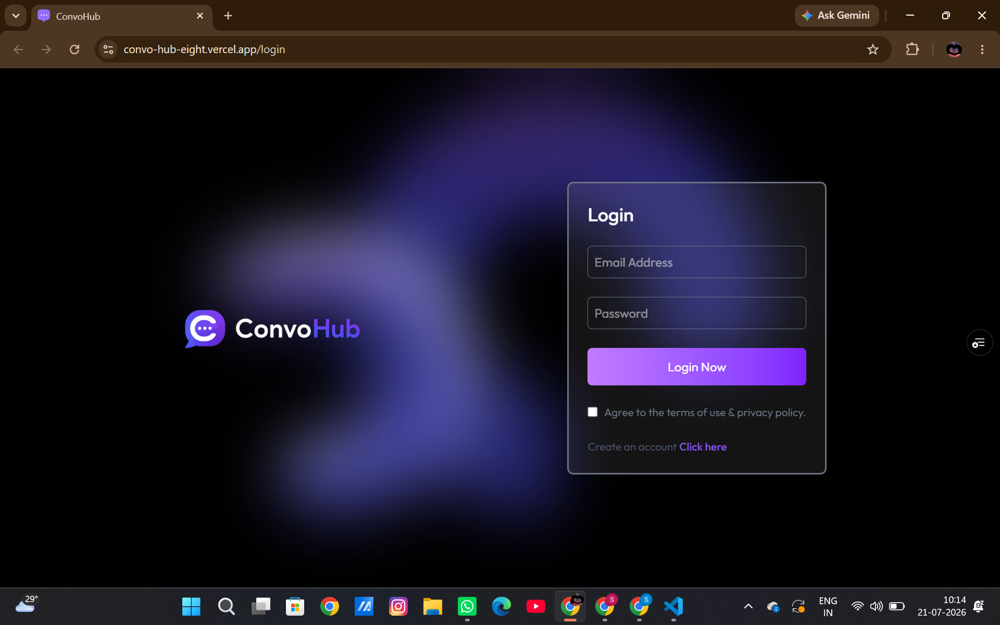
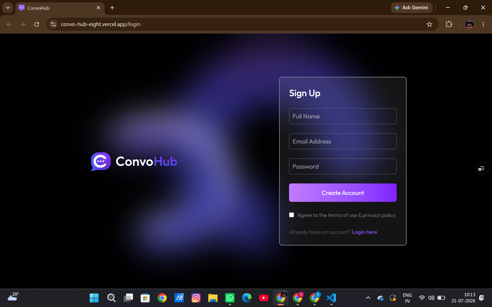
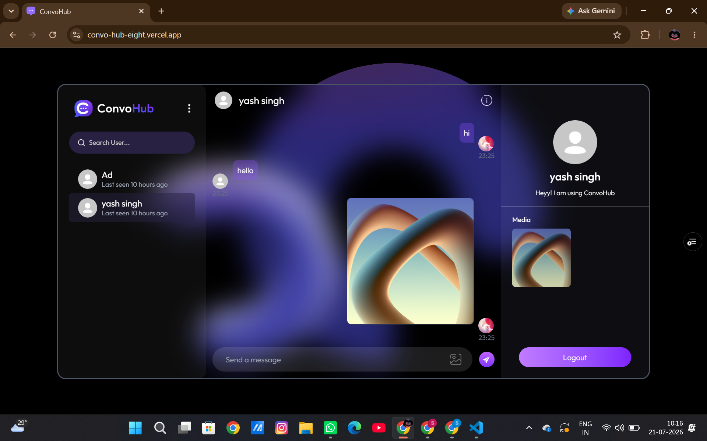
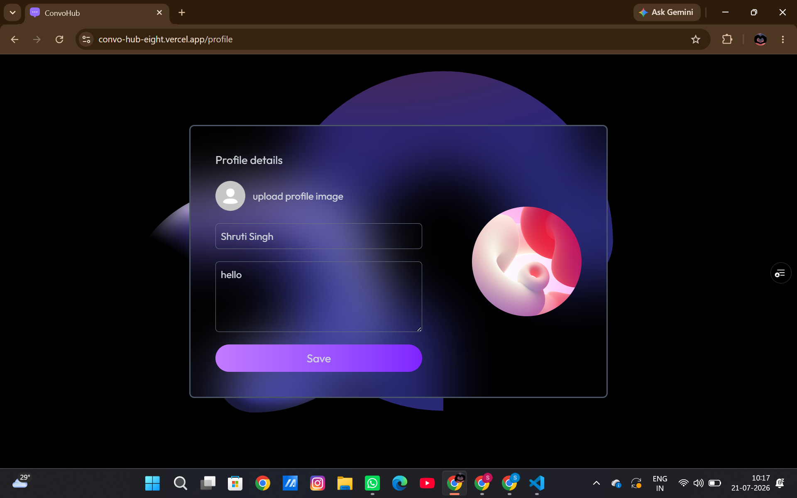
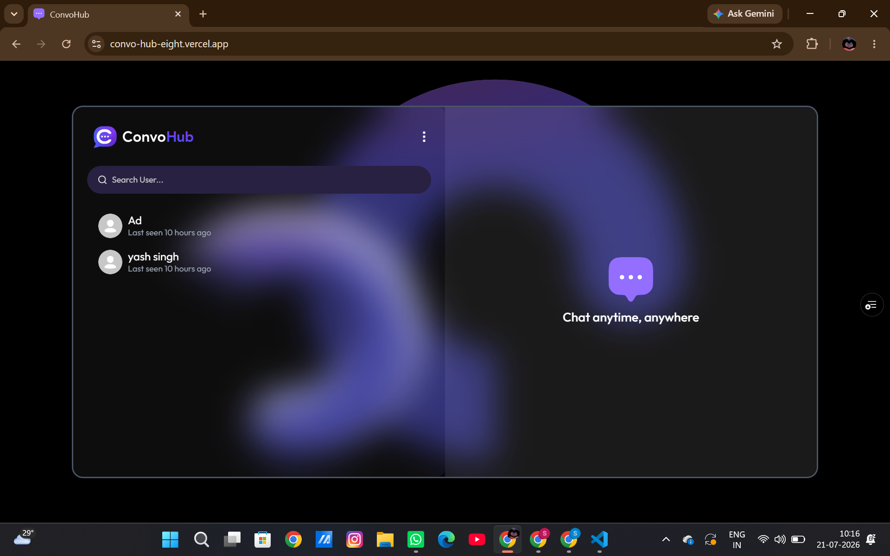

# 💬 ConvoHub

<div align="center">


### A Modern Real-Time Chat Application built with the MERN Stack


</div>

---

<div align="center">

## 🚀 Explore ConvoHub

| 🌐 Live Demo | 🎥 Demo Video | 💻 GitHub Repository |
|:------------:|:-------------:|:--------------------:|
| **[Visit ConvoHub](https://convo-hub-eight.vercel.app/login)** | **[Watch Demo](https://drive.google.com/file/d/1EGeye2cRLKOTHJHdG_5hfqExur2ipyyG/view)** | **[View Source Code](https://github.com/shruti240104/ConvoHub)** |

</div>

---

# 📌 About

**ConvoHub** is a full-stack real-time chat application built with the **MERN Stack** and **Socket.IO**. It enables users to exchange instant text and image messages while providing secure authentication, online presence tracking, last-seen status, unseen message notifications, and profile customization through an elegant, responsive interface.

---

# ✨ Features

- 🔐 Secure JWT Authentication & Authorization
- 💬 Real-time One-to-One Messaging
- 🖼️ Image Sharing via Cloudinary
- 🟢 Live Online / Offline Status
- 🕒 Last Seen Functionality
- 🔔 Unseen Message Counter
- 👤 Profile Editing & Avatar Upload
- 🔍 Search Users Instantly
- 📱 Responsive Design for Desktop & Mobile
- ⚡ Instant Updates using Socket.IO

---

# 📸 Screenshots

## 🔐 Login Page



---

## 📝 Signup Page



---

## 💬 Chat Interface



---

## 👤 Profile Page



---

## 📂 Sidebar



---

# 🛠️ Tech Stack

### Frontend

- React.js
- Tailwind CSS
- React Context API
- Axios
- Socket.IO Client
- React Router

### Backend

- Node.js
- Express.js
- MongoDB
- Mongoose
- JWT Authentication
- Socket.IO
- Cloudinary

---

# 📂 Project Structure

```text
ConvoHub
│
├── client
│   ├── src
│   │   ├── assets
│   │   ├── components
│   │   ├── context
│   │   ├── lib
│   │   ├── pages
│   │   └── main.jsx
│   │
│   ├── public
│   └── package.json
│
├── server
│   ├── controllers
│   ├── middleware
│   ├── models
│   ├── routes
│   ├── lib
│   ├── server.js
│   └── package.json
│
├── screenshots
│
└── README.md
```

---

# 🚀 Getting Started

## 1️⃣ Clone the Repository

```bash
git clone https://github.com/shruti240104/ConvoHub.git

cd ConvoHub
```

---

## 2️⃣ Install Dependencies

### Client

```bash
cd client
npm install
```

### Server

```bash
cd ../server
npm install
```

---

## 3️⃣ Configure Environment Variables

### Server (`server/.env`)

```env
PORT=5000

MONGODB_URI=your_mongodb_uri

JWT_SECRET=your_secret_key

CLOUDINARY_CLOUD_NAME=your_cloud_name

CLOUDINARY_API_KEY=your_api_key

CLOUDINARY_API_SECRET=your_api_secret
```

---

### Client (`client/.env`)

```env
VITE_BACKEND_URL=http://localhost:5000
```

---

## 4️⃣ Run the Application

### Start Backend

```bash
cd server
npm run server
```

### Start Frontend

```bash
cd client
npm run dev
```

Open:

```
http://localhost:5173
```

---

# 🌟 Key Highlights

- ✔ Secure JWT Authentication
- ✔ Real-Time Socket.IO Communication
- ✔ Cloudinary Image Uploads
- ✔ Live Online/Offline Presence
- ✔ Last Seen Tracking
- ✔ Unseen Message Notifications
- ✔ Responsive User Interface
- ✔ Fast User Search
- ✔ Profile Management

---

# 🔮 Future Improvements

- 💬 Group Chats
- 🎙 Voice Calling
- 📹 Video Calling
- 😀 Emoji Picker
- ❤️ Message Reactions
- ⌨️ Typing Indicators
- 📌 Pinned Chats
- 🔔 Push Notifications
- 🌙 Dark / Light Theme
- 📂 File Sharing

---

# 👩‍💻 Author

### Shruti Singh

🔗 **GitHub:**  
https://github.com/shruti240104

🔗 **LinkedIn:**  
https://www.linkedin.com/in/shrutisingh24

---

<div align="center">

### ⭐ If you found this project helpful, please consider giving it a Star!

It motivates me to build and share more projects.

⭐ **Star this repository if you like it!** ⭐

</div>